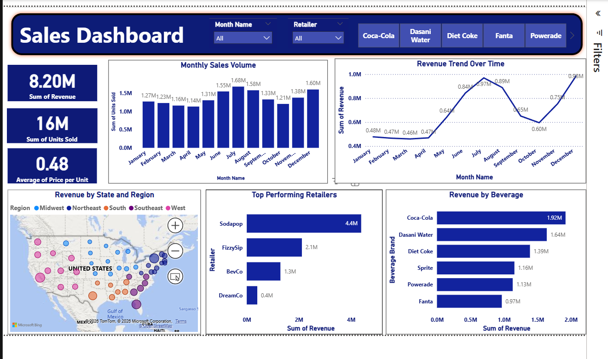

# 📊 Sales Analytics Dashboard (Power BI)

## 🔍 Overview

This project presents an interactive **Sales Analytics Dashboard** built using Power BI.
The dashboard provides insights into **revenue trends, sales volume, product performance, and regional distribution**, enabling data-driven decision-making.

---

## 🎯 Objective

The goal of this project is to:

* Analyse sales performance across different dimensions (time, region, product, retailer)
* Identify key drivers of revenue growth
* Provide a clear and interactive dashboard for business stakeholders

---

## 🛠️ Tools & Technologies

* **Power BI** – Data visualisation and dashboard development
* **DAX (Data Analysis Expressions)** – Calculated measures and time intelligence
* **Data Modelling** – Relationship management and structured dataset

---

## 📁 Dataset Description

The dataset contains ~3,700 records with the following fields:

* Date
* Month / Month Name
* Region and State
* Retailer
* Beverage Brand
* Units Sold
* Price per Unit
* Revenue

---

## 📌 Key Features

* 📈 **KPI Metrics**

  * Total Revenue
  * Total Units Sold
  * Average Price per Unit

* 📊 **Trend Analysis**

  * Monthly Sales Volume
  * Revenue Trend Over Time

* 🏪 **Retailer Performance**

  * Comparison of top-performing retailers

* 🥤 **Product Analysis**

  * Revenue contribution by beverage brand

* 🌍 **Geographical Insights**

  * Revenue distribution across states and regions

* 🎛️ **Interactive Filters**

  * Month
  * Retailer
  * Beverage Category

---

## 📊 Key Insights

* Revenue peaks during mid-year, indicating seasonal demand patterns
* Coca-Cola and Dasani Water are the top revenue-generating products
* Sodapop is the highest-performing retailer
* Northeast region contributes significantly to total sales

---

## 🖼️ Dashboard Preview

---

---

## 🚀 How to Use

1. Download the `.pbix` file from this repository
2. Open in Power BI Desktop
3. Interact with filters and visuals to explore insights

---

## 💡 Learning Outcomes
* Power Query – Data cleaning and transformation
* Developed understanding of **data modelling and relationships**
* Applied **DAX functions for time-based analysis**
* Designed a **business-focused interactive dashboard**
* Improved skills in **data storytelling and visualisation best practices**

---

## 📬 Contact

If you would like to discuss this project or collaborate, feel free to connect.

---

⭐ If you found this project useful, consider giving it a star!
